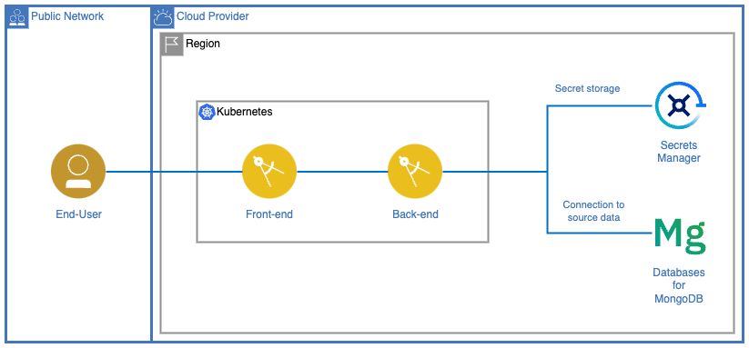

# Watson Airlines Customer Experience

- [Watson Airlines Customer Experience](#watson-airlines-customer-experience)
  - [1. Introduction](#1-introduction)
    - [1.1. About Watson Airlines](#11-about-watson-airlines)
    - [1.2. Business Challenge](#12-business-challenge)
  - [2. About Solution](#2-about-solution)
    - [2.1. Application Architecture](#21-application-architecture)
    - [2.2. Repository Structure](#22-repository-structure)
    - [2.3. Functional requirements](#23-functional-requirements)
    - [2.4. Implementation Considerations](#24-implementation-considerations)
  - [3. Database specifications](#3-database-specifications)
    - [3.1. Flights](#31-flights)
    - [3.2. Airports](#32-airports)
    - [3.3. Airlines](#33-airlines)
  - [4. Environment Setup](#4-environment-setup)
    - [4.0. Prerequisites](#40-prerequisites)
    - [4.1. Environment variables](#41-environment-variables)
    - [4.2. MongoDB Connection](#42-mongodb-connection)
  - [5. Solution Deployment](#5-solution-deployment)
  - [6. Solution Delivery](#6-solution-delivery)
    - [6.1. Deliverables](#61-deliverables)
    - [6.2. Focal Points](#62-focal-points)
  - [References](#references)
  - [Authors](#authors)

## 1. Introduction

### 1.1. About Watson Airlines

Watson Airlines is a one of the largest airlines in North America. With over 30 years of history, we connect people to opportunities while expanding the understanding of our planet and the people within it. We offer our one-of-a-kind value and Hospitality at over 50 airports across more than 15 countries. In addition, we are members of the [International Air Transport Association (IATA)](https://www.iata.org/en/about/), a trade association that represents over 300 airlines, equivalent to about 83% of total air traffic. This allows us to operate safely, securely, efficiently, and economically under clearly defined rules.

We are pioneers in the usage of technology, and actively advocate for its usage to improve our customer's experience.

### 1.2. Business Challenge

Watson Airlines wishes to provide its clients with a better user experience, focused on ease of use and customer self-service. One of their biggest difficulties at the moment is providing information to passengers about existing flights, departure times, and possible delays. Clients find obtaining this information is difficult, and Watson Airlines is unable to provide efficient-enough assistance with their existing personnel.

To solve this problem, Watson Airlines wishes to re-design their website, adding capabilities that allow their clients to search and book flights on their own, reducing friction and offering a better experience.

To develop this solution, Watson Airlines is willing to provide access to a database containing information on flights from both its company and others as well as their corresponding airports, both shared by IATA as part of their alliance.

## 2. About Solution

### 2.1. Application Architecture



Expected application flow is as follows:

1. End-user accesses web application via Internet. See **note** below for more details.
2. Landing page greets user. Options for flight search are displayed, allowing to choose origin, destination, and estimated date range (should present itself as optional and flexible).
3. When users requests information stored on the database, front-end should communicate with backend via HTTP request to retrieve the data.
4. The backend service will connect to the external database, a [Databases for MongoDB](https://www.ibm.com/cloud/databases-for-mongodb) (DBaaS) cloud instance, and execute a query. Its source code must be stored on this repository's [source folder](./source/).
5. Data will be sent back from the backend service to the frontend and displayed to the user on the interactive chat window.

### 2.2. Repository Structure

```
.
├── assets/               # Documentation Assets
├── images/               # Images used in the present document
├── source/               # Application source code
│   ├── back-end/         # Backend microservice
│   │   └── sample/       # Development Assets & Samples
│   └── front-end/        # Frontend microservice
└── README.md             # Present document
```

### 2.3. Functional requirements

Watson Airlines requires the website be able to:

1. **Associated Airlines**. Provide the list of airlines associated with the initiative, all of them located under the 'Airlines' collection within the database.
2. **About Watson Airlines**. Offer a short description about Watson Airlines. The information shall be obtained from the [About Watson Airlines](#11-about-watson-airlines) section of this document.
3. **Search for Flights**. Customers will be able to request a list of available flights based on the following criteria:
   1. Origin Airport (IATA code) & Destination Airport (IATA code)
   2. Departure Date (date range in format `mm-yyyy-dd`). *Tip:* To reduce query results, it's recommended to request additional parameters, such as airline or origin/destination airports.
4. **Request Flight information**. Customers shall be able to obtain information about a specific flight. *Tip:* this operation can be done by performing a search by Object ID.

### 2.4. Implementation Considerations

- While JavaScript/NodeJS is the preferred programming language, any might be used for developing both the REST API and Web Application.
- Website language **must be** English.
- In order to meet the aviation industry's Safety Quality and Compliance requirements, it is **imperative** for Watson Airline's solutions to meet the [best development standards](https://owasp.org/www-project-secure-coding-practices-quick-reference-guide/stable-en/02-checklist/05-checklist) and practices for security and scalability.
- Environment variables established in [this document](#41-environment-variables) must be respected. However, additional ones might be defined if deemed necessary.
- The Client will provide you with access credentials to both the Database and Secret Manager instances, via e-mail.
- All source code must be located under the [source folder](./source/). Backend code shall be put under [back-end](./source/back-end/) and frontend code under [front-end](./source/front-end/). You are free to structure these folder as you see fit, but know that clarity and order will be taken into account when evaluating the implementation.

## 3. Database specifications

### 3.1. Flights

Flight data stored on the database can be located under the `flights` collection and contains the following information:

- `AIRLINE` (String) - Airline Identifier.
- `FLIGHT_NUMBER` (Number) - Flight Identifier.
- `ORIGIN_AIRPORT` (String) - Starting Airport (IATA Code).
- `DESTINATION_AIRPORT` (String) - Destination Airport (IATA Code).
- `CANCELLED` (Boolean) - Indicates whether flight was cancelled.
- `DEPARTURE_DATE` (Date) - Flight Departure Date & Time. Format *yyyy-mm-dd hh:mm:ss*.
- `ARRIVAL_DATE` (Date) - Flight Arrival Date & Time. Format *yyyy-mm-dd hh:mm:ss*.

Example:

```json
{
    "_id": "63e53b3f123da255099f3700",
    "AIRLINE": "WA",
    "FLIGHT_NUMBER": 185,
    "ORIGIN_AIRPORT": "OGG",
    "DESTINATION_AIRPORT": "HNL",
    "CANCELLED": true,
    "DEPARTURE_DATE": "2023-01-01T14:45:00.000Z",
    "ARRIVAL_DATE": "2023-01-01T15:21:00.000Z"
}
```

### 3.2. Airports

Airport data can be found under the `airports` collection, which contains:

- `IATA_CODE` (String) - Location Identifier.
- `AIRPORT` (String) - Airport's Name.
- `CITY` (String) - Airport's City.
- `STATE` (String) - Airport's State.
- `COUNTRY` (String) - Airport's Country.

Example:

```json
{
  "_id": "63dd87f9fd4b3618756969be",
  "IATA_CODE": "ABE",
  "AIRPORT": "Lehigh Valley International Airport",
  "CITY": "Allentown",
  "STATE": "PA",
  "COUNTRY": "USA"
}
```

### 3.3. Airlines

Air Line data can be found under the `airlines` collection, which contains:

- `IATA_CODE` (String) - Airline's Identifier.
- `AIRLINE` (String) - Airline's Name.

Example:

```json
{
  "_id": "63dd87e1fd4b3618756969bc",
  "IATA_CODE": "WA",
  "AIRLINE": "Watson AirLines"
}
```

> The provided information was generated based on the "2015 Flight Delays and Cancellations" dataset. For more information visit the [Kaggle website](https://www.kaggle.com/datasets/usdot/flight-delays).

## 4. Environment Setup

### 4.0. Prerequisites

- If running outside containers, installing [NodeJS](https://nodejs.org/en/download/) is required.
- A container runtime will need to be installed. Recommendations are [Docker](https://docs.docker.com/get-docker/) and [Podman](https://podman.io/getting-started/installation).
- Should you wish to connect to the database via GUI, a MongoDB-compatible client is needed. [Compass](https://www.mongodb.com/docs/compass/current/install/) is recommended. **Note:** to connect to the Database instance, TLS/SSL certificate is required. Visit the [Compass documentation](https://www.mongodb.com/docs/compass/current/connect/advanced-connection-options/tls-ssl-connection/) to learn how to configure it when connecting.

### 4.1. Environment variables

Environment variables are dynamic values that can be stored and used by different processes on a Operative System (OS). They allow for values to be defined externally, without having to access the application's source code.

The application's environment variables are the following.

- `MONGO_DB_URI`. Databases for MongoDB URI connection string. Example format: `mongodb://$USERNAME:$PASSWORD@$HOSTNAME:$PORT/$DATABASE?$PARAMS`.
- `SECRET_MANAGER_APIKEY`. Secrets Manager instance API Key.
- `SECRET_MANAGER_URL`. Secrets Manager instance URL.
- `SECRET_MANAGER_CERT_ID`. Certificate ID in the Secrets Manager instance.

> **Note:** This information will be provided to you via e-mail.

Once you have this information, you must create a `.env` file where your code is located. See the [`.example.env`](./source/.example.env) file for reference.

Afterwards, you must load those variables into your code. There are several packages available depending on your programming language. For JavaScript, for instance, the most popular one is [dotenv](https://www.dotenv.org/).

### 4.2. MongoDB Connection

Download the `.zip` file containing the [environment variables](#41-environment-variables) previously mentioned, and un-compress its contents in your code's source folder.

A [sample code](./source/back-end/sample/sample.mongodb.js) has been provided to you, so it can be imported into your application. To make sure it works properly, you must first install its dependencies, namely `mongoose` and `dotenv`. You can do this by running: `npm install` from the code's directory.

Then, from your code, load the environment variables and invoke the `create_connection()` function, which will automatically connect to MongoDB. See an example below:

```javascript
const path = require("path");
const mongoose = require('mongoose');
const mongo = require("./sample.mongodb");

async function main(){

    // Get global variables from .env file
    require("dotenv").config({path: path.resolve(__dirname,".env")});

    // Connect to database
    const { create_connection } = require("./sample.mongodb");
    await create_connection();    
    
    ...    
}

main();
```

The console will display a `MongoDB connection successful.` message. Afterwards, you can access MongoDB's data, specified in a [previous section](#3-database-specifications), by using mongoose's [schemas](https://mongoosejs.com/docs/guide.html). A [sample](./source/back-end/sample/sample.schema.js) definition has been provided for you. You can import this sample and invoke mongo operations from it. 

See an example for listing a schema's objects below:

```javascript
const Sample = require("./sample.schema");

async function sample_schema(){

  console.log(await Sample.find({}));

}
```

Should you desire to connect to MongoDB using Compass or similar offerings, you must obtain the TLS secret from the Secrets Manager instance. To do so, use the `GET /api/v2/secrets` endpoint to obtain the secret, by it's ID. This value has been provided to you.

See the [Secret Manager API Docs](https://cloud.ibm.com/apidocs/secrets-manager/secrets-manager-v2) for more information.

## 5. Solution Deployment

You are **not** expected to deploy this application on any real Kubernetes platform. However, you **are** expected to containerize the application and prepare it for deployment to a real Kubernetes environment.

You can use [minikube](https://minikube.sigs.k8s.io/docs/start/) to simulate a Kubernetes environment on your local machine.

It is recommended you create a [Deployment](https://kubernetes.io/docs/concepts/workloads/controllers/deployment/) for each microservice, using YAML files.

## 6. Solution Delivery

After the challenge is presented to you, you will receive an e-mail will containing the assets you'll need to complete it.

You will have **one week** to complete the challenge, starting from the moment the e-mail is sent to you.

### 6.1. Deliverables

Once you have finished the challenge, or your time has ran out, you must deliver the following assets:

1. **Source code**
   1. Application source code. See [implementation considerations](#24-implementation-considerations) for more information.
   2. Code must be *submitted via e-mail*, by sending a `.zip` copy of your repository.
2. **Showcase video**
   1. Video detailing what the challenge was about, how you implemented it, and what you learned from the experience.
   2. Duration must be between **two and five minutes**. This will be taken into consideration during evaluation.
   3. `.mp4` format is preferred.
   4. The video **must be in English**, so the client's Technical Leadership can understand it.
   5. This video can be *sent via e-mail*. Do not include it as part of this repository.

### 6.2. Focal Points

Communication, both for questions and delivery purposes, must be sent to:

- `Gabriela Retamosa`. Senior Leader | Build Lab SSA & MX. [gabyretamosa@uy.ibm.com](mailto:gabyretamosa@uy.ibm.com)
- `Josefina R. Casanova`. Engagement Lead, Data & AI | Build Lab Americas. [josefinarcasanova@ibm.com](mailto:josefinarcasanova@ibm.com)
- `Sebastian Fripp`. Associate Engagement Lead, Cloud & Automation | Build Lab Americas. [sfripp@ibm.com](mailto:sfripp@ibm.com)
- `Nadia dos Santos`. Associate Engagement Lead, Security | Build Lab Americas. [nadoadossantos@ibm.com](mailto:nadoadossantos@ibm.com)

## References

- [Documentation - Databases for MongoDB](https://cloud.ibm.com/docs/databases-for-mongodb?topic=databases-for-mongodb-getting-started)
- [Documentation - IBM Secrets Manager](https://cloud.ibm.com/docs/secrets-manager)

## Authors

- [Josefina R. Casanova](https://github.com/josefinarcasanova). Engagement Lead, Data & AI | Build Lab Americas.